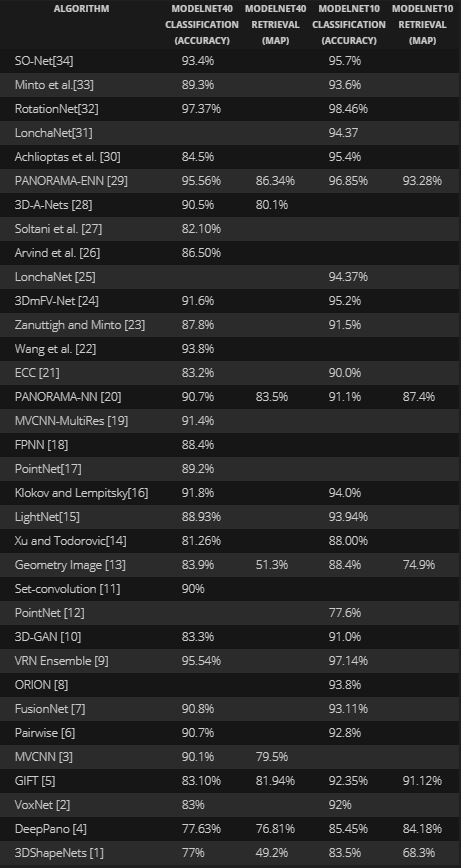

# 100-days-machine-learning-journey
Each day i study a little about machine-learning/deep-learning and share what i learnt

# Journey Plan:
1. CNN
    - Classification: 2D, 3D
    - Regression
    - Differentiation
    - Graph CNN
1. RNN
1. Reinforcement Learning
1. Meta Learning
1. Semi Supervised Learning
1. Active Learning
1. Quantum Machine Learning
1. NeuroEvolution
1. Decentralize Data
1. Others
    Clustering

# Journey tracking

## Day 1 - 2018/12/11: Point Cloud Classification-Segmentation algorithms

> A point cloud is a set of data points in space. 
Point clouds are generally produced by 3D scanners: LIDAR, Kinect, ...

**Approach Classification**
1. Pixel-based: Multi-view CNN(MVCNN)
2. Voxel-based: VoxNet, VRN Ensemble, ...
3. 3D point-based: PointNet

**Great article**

[3D POINT CLOUD CLASSIFICATION USING DEEP LEARNING – RECENT WORKS - 20Sep2017](http://www.itzikbs.com/3d-point-cloud-classification-using-deep-learning)

*Benchmark table of Point Cloud Classification*

[image source](http://blog.ruofeidu.com/summary-pointnet-pointnet-and-pu-net/)

## Day 2 - 2018/12/12: Train Network with Noise to Reduce Overfitting

**Learning Stories** [Train Neural Network với Nhiễu để giảm Overfitting](https://medium.com/@minhnc.edu.tw/train-neural-network-v%E1%BB%9Bi-nhi%E1%BB%85u-%C4%91%E1%BB%83-gi%E1%BA%A3m-overfitting-dfb8984e9eeb)

## Day 3 - 2018/12/13: Active Learning

> Active Learning is not a kind of Deep Learning or Reinforcement Learning. It is a process by which train model on the data it will learn the most from.

> It seems like inherit from the idea of Semi Supervised Learning

**Learning Stories** [Học có chọn lọc(Active Learning)](https://medium.com/@minhnc.edu.tw/active-learning-89af14245083)
